# ShopEase

## Premium E-Commerce Web Application

| Website / Service | Link |
|---|---|
| ShopEase Website | http://shopease-frontend-2026-ishant.s3-website-us-east-1.amazonaws.com |
| Amazon API Gateway | https://nxdrpc6yk3.execute-api.us-east-1.amazonaws.com |
| Orders API Example | https://nxdrpc6yk3.execute-api.us-east-1.amazonaws.com/orders |
| Demo Video | https://youtu.be/aGtENCu8qPU

## Note
### 📌 S3 Website Access – Desktop and Mobile Testing

> **Access Note:**  
> The Amazon S3 Static Website Endpoint used in this project is an **HTTP-based website endpoint**. Therefore, the method of accessing the website may differ slightly between desktop and mobile-device testing.
>
> #### 💻 Desktop / Laptop Access
>
> On a laptop or desktop computer, the ShopEase website can be accessed directly using the following S3 website endpoint:
>
> `http://shopease-frontend-2026-ishant.s3-website-us-east-1.amazonaws.com`
>
> The URL can be opened directly in a web browser for testing the website hosted on Amazon S3.
>
> #### 📱 Mobile Access
>
> When testing the ShopEase website on a mobile device, copy the S3 website link and paste it directly into the mobile web browser.
>
> If the browser automatically uses `https://`, the protocol should be changed to `http://` because the Amazon S3 Static Website Endpoint used in this project is HTTP-based.
>
> **Example:**
>
> Incorrect for the S3 Static Website Endpoint:
>
> `https://shopease-frontend-2026-ishant.s3-website-us-east-1.amazonaws.com`
>
> Correct:
>
> `http://shopease-frontend-2026-ishant.s3-website-us-east-1.amazonaws.com`
>
> In other words, remove the **`s`** from `https://` so that it becomes `http://`. After making this change, open the URL in the browser to access the S3-hosted ShopEase website.
>
> #### 🔐 HTTPS Access Using Amazon CloudFront
>
> For secure HTTPS access across devices, including mobile devices, **Amazon CloudFront can be configured as the HTTPS delivery layer** in front of the S3-hosted website.
>
> Once CloudFront is configured with an SSL/TLS certificate, the CloudFront URL can be used for secure HTTPS access without manually changing `https://` to `http://`.
>
> **Note:** The current ShopEase deployment uses the **Amazon S3 Static Website Endpoint** for website hosting. Therefore, the S3 endpoint should be accessed using `http://`.


## 📌 Project Overview

ShopEase is a real-time serverless e-commerce application developed as an AWS major project. It provides product browsing, category filtering, search, product details, ratings and reviews, cart, wishlist, checkout, sandbox payment, order management, invoice generation, tracking, cancellation, returns, warranty and customer support.

| Item | Details |
|---|---|
| Project Name | ShopEase |
| Project Type | AWS Major Project |
| Frontend | HTML5, CSS3, Browser JavaScript |
| Backend | Python / boto3 |
| Hosting | Amazon S3 |
| API | Amazon API Gateway |
| Compute | AWS Lambda |
| Database | Amazon DynamoDB |
| Email | Amazon SES |
| Monitoring | Amazon CloudWatch |
| Security | AWS IAM |
| Development | Visual Studio Code |
| Source Control | Git / GitHub |

## 🎯 Objectives

- Build a professional responsive e-commerce application.
- Implement product browsing, search, categories, filters and sorting.
- Provide authentication, account, cart and wishlist functionality.
- Implement checkout and sandbox payment.
- Create and manage orders with idempotency protection.
- Provide order history, tracking, cancellation and invoices.
- Support returns, replacements, warranty and customer support.
- Store application data using DynamoDB.
- Deploy the frontend using Amazon S3.
- Monitor backend execution with CloudWatch.

## 🌐 Main Features

- Home page and product catalog
- Category navigation
- Product search, sorting and filtering
- Product details and related product images
- Product ratings and reviews
- Shopping cart
- Wishlist
- Coupons and discounts
- Shipping address management
- Checkout
- Sandbox payment
- My Account
- My Orders
- Order Details
- Order Tracking
- Order Cancellation
- Returns and Replacements
- Warranty Claims
- PDF Tax Invoice
- Customer Support
- Admin Analytics
- Theme preferences
- Responsive desktop, tablet and mobile UI

## 🔐 Authentication

ShopEase supports signup, login, logout, profile management, password changes and password reset.

Passwords are salted and hashed using SHA-256. Browser authentication uses the Web Crypto API when available. Sessions are stored in localStorage and expire after seven days.

Guest cart and wishlist data can be migrated when a user signs in or registers. Authenticated cart and wishlist data synchronize with DynamoDB.

## 🛒 Cart, Wishlist & Checkout

Guest cart/wishlist data use browser storage, while authenticated data synchronize with DynamoDB.

Supported coupons:

```text
WELCOME10
FESTIVE20
FLAT500
```

Checkout collects shipping information, payment details and order information.

## 💳 Sandbox Payment

The project includes a local sandbox payment gateway.

Supported methods:

- Credit/Debit Card
- UPI
- Net Banking

Sandbox testing includes card validation, expiry/CVV validation, simulated bank authorization, OTP verification and intentional decline simulation.

Test OTP:

```text
123456
```

No real money is charged.

## 📦 Order Management

Orders contain items, payment information, shipping information, status, tracking and cancellation/refund information.

Order creation uses DynamoDB transactional writes and an idempotency key to prevent duplicate order creation.

Orders can be cancelled according to their current status. Cancellation records include reason, notes, timestamp, refund status and refund amount where applicable.

## 🧾 Invoice & Tracking

PDF invoices are generated using **jsPDF** and **AutoTable**.

Invoices include product itemization, GST, HSN codes, shipping, discounts, totals and customer details. Cancelled orders use VOID/CANCELLED invoice information.

Order tracking provides carrier, tracking number, estimated delivery and status timeline. The tracking timeline becomes vertical on smaller screens.

# ☁️ AWS Architecture

```text
User Browser
     |
     v
Amazon S3
(Static Frontend)
     |
     v
Amazon API Gateway
     |
     v
AWS Lambda
(Python Backend)
     |
     +----------------------+
     |                      |
     v                      v
Amazon DynamoDB        Amazon SES
     |
     v
CloudWatch Logs

AWS IAM
Access control and permissions
```

## ⚡ AWS Lambda

**Function:** `ShopEaseOrderFunction`  
**Region:** `us-east-1`  
**Language:** Python

Lambda handles backend operations for users, orders, cart, wishlist, reviews, support, returns and warranty workflows.

## 🔌 Amazon API Gateway

**Base URL:**

```text
https://nxdrpc6yk3.execute-api.us-east-1.amazonaws.com
```

Example:

```text
https://nxdrpc6yk3.execute-api.us-east-1.amazonaws.com/orders
```

Main routes include:

| Method | Route | Purpose |
|---|---|---|
| POST | `/orders` | Create an order |
| GET | `/orders` | Retrieve orders |
| POST/PUT | `/orders/cancel` | Cancel order |
| POST/PUT | `/orders/return` | Return/replacement |
| POST/PUT | `/orders/warranty` | Warranty claim |
| POST | `/users/signup` | Register user |
| POST | `/users/login` | Authenticate user |
| POST | `/users/password-reset/request` | Password reset request |
| POST | `/users/password-reset/confirm` | Password reset confirmation |
| GET/POST/DELETE | `/cart` | Cart operations |
| GET/POST/DELETE | `/wishlist` | Wishlist operations |
| GET/POST | `/reviews` | Product reviews |
| GET/POST | `/tickets` | Support tickets |
| GET/POST | `/support` | Support operations |

## 🗄️ Amazon DynamoDB

| Table | Stores |
|---|---|
| ShopEaseOrder | Orders, items, payment, status, cancellation, refund, returns, replacement, tracking and warranty |
| ShopEaseUsers | User profiles, credentials, addresses and account information |
| ShopEaseCart | Authenticated users' cart items and quantities |
| ShopEaseWishlist | Authenticated users' wishlist products |
| ShopEaseReviews | Product reviews, ratings and comments |
| ShopEaseSupportTickets | Support, return, replacement and warranty tickets |

## 🪣 Amazon S3

S3 hosts the ShopEase static frontend.

**Bucket:**

```text
shopease-frontend-2026-ishant
```

**Website Endpoint:**

```text
http://shopease-frontend-2026-ishant.s3-website-us-east-1.amazonaws.com
```

## 📧 Amazon SES

Amazon SES is used for password-reset email functionality when configured.

## 📊 CloudWatch

Lambda uses Python `print()` statements for logging. Logs include request IDs, order creation attempts, idempotent order replays, DynamoDB writes and errors.

Recorded test metrics:

| Metric | Result |
|---|---:|
| Invocations | 37 |
| Errors | 0 |
| Success Rate | 100% |
| Average Duration | ~1321 ms |
| Maximum Duration | ~4261 ms |

## 🔐 IAM

The IAM policy allows Lambda to:

- Read/write the six DynamoDB tables.
- Query and scan DynamoDB tables and indexes.
- Perform transactional DynamoDB writes.
- Create/write CloudWatch Logs.
- Send password-reset emails through SES.

Sensitive credentials and admin allowlists should be configured through environment variables and should not be committed to GitHub.

## 🛠️ Technologies Used

- HTML5
- CSS3
- Browser JavaScript
- Python
- boto3
- AWS Lambda
- Amazon API Gateway
- Amazon DynamoDB
- Amazon S3
- Amazon SES
- Amazon CloudWatch
- AWS IAM
- Web Crypto API
- localStorage / sessionStorage
- jsPDF
- jsPDF AutoTable
- Inline SVG
- External image/CDN resources
- Google Fonts where referenced

## 📁 Project Structure

```text
AWS2/
├── backend/
│   ├── ADMIN_TEST_SETUP.md
│   ├── deploy_aws.py
│   ├── iam_policy.json
│   ├── lambda_function.py
│   └── lambda_function.zip
├── frontend/
│   ├── *.html
│   ├── css/
│   ├── js/
│   ├── assets/
│   ├── product_list.json
│   ├── all_products_by_category.txt
│   └── scratch_catalog.txt
├── scratch/
└── README.md
```

## 📱 Responsive Design

Responsive behavior is implemented in `frontend/css/responsive.css`.

Breakpoints include:

```text
1023px
900px
767px
640px
600px
380px
```

Mobile features include collapsible navigation, responsive product grids, mobile-friendly filters, single-column layouts, responsive cart/checkout, vertical order tracking and mobile-friendly account menus.

# 📸 Project Screenshots

> Add the actual screenshots to a `screenshots/` folder in the project root. The image names below are placeholders for the actual evidence screenshots.

### Figure 1 — AWS Management Console

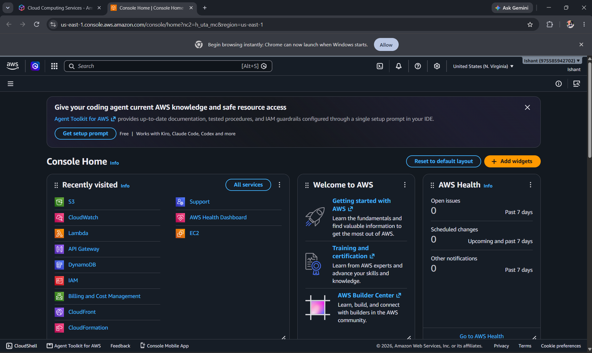

### Figure 2 — Amazon S3 Bucket

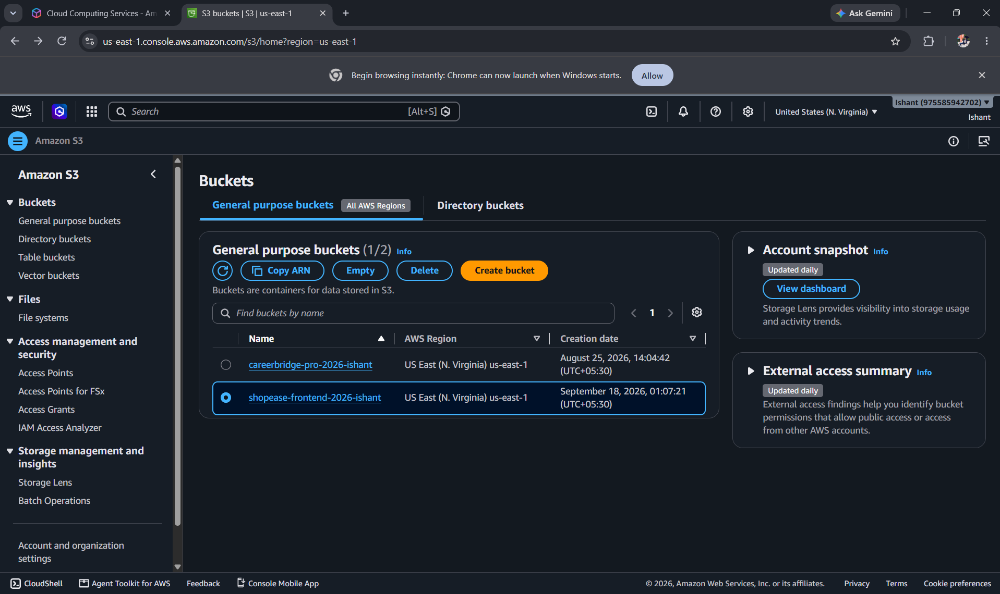

### Figure 3 — S3 Uploaded Frontend Files

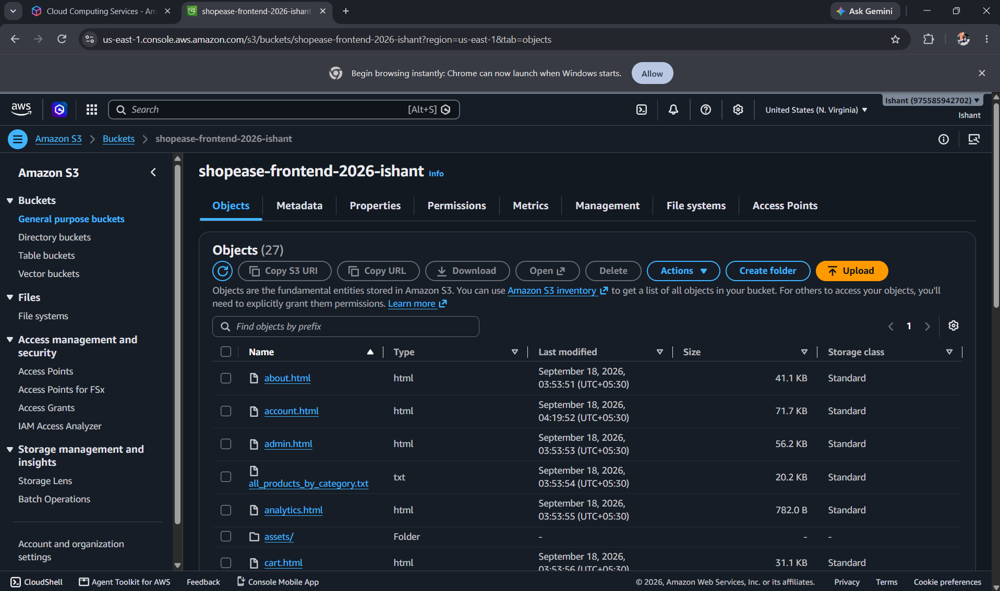

### Figure 4 — S3 Static Website Hosting

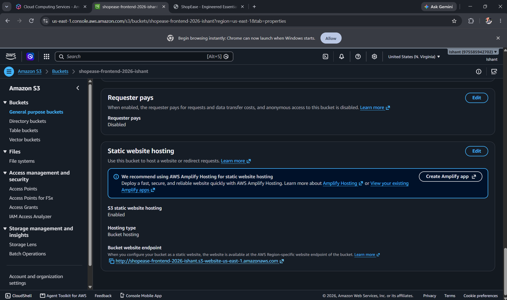

### Figure 5 — S3 Permissions / Policy

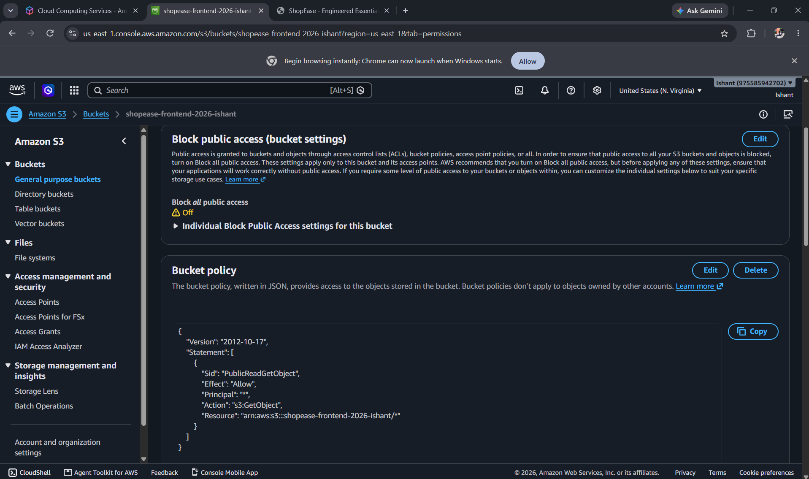

### Figure 6 — ShopEase Website


### Figure 7 — API Gateway

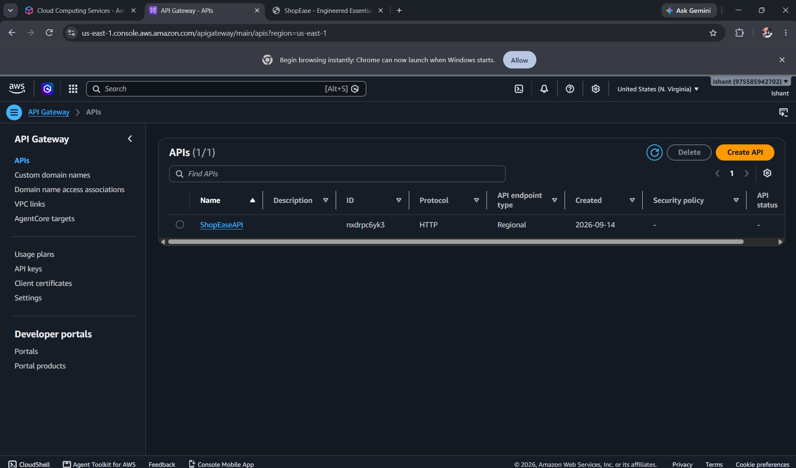

### Figure 8 — AWS Lambda

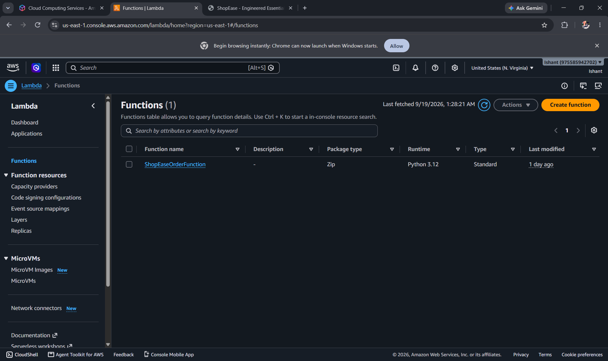

### Figure 9 — DynamoDB

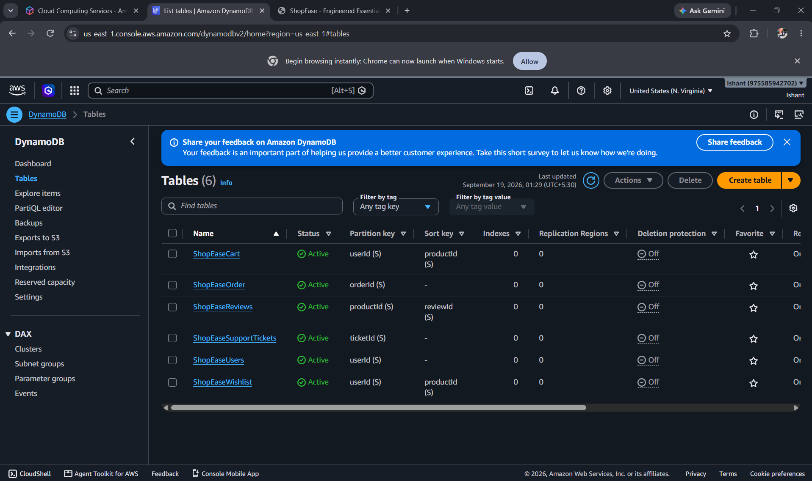

### Figure 10 — CloudWatch

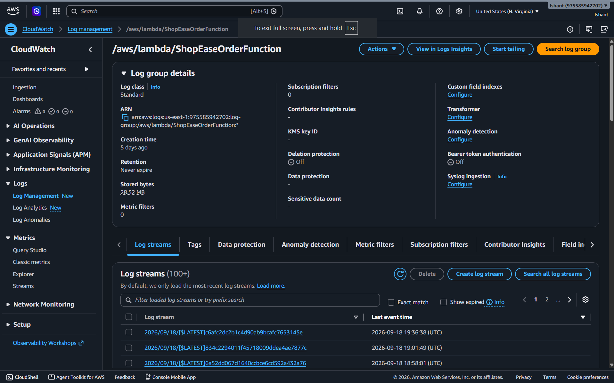

### Figure 11 — ShopEase Desktop

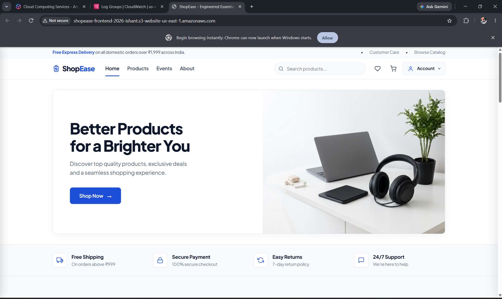

### Figure 12 — ShopEase Mobile

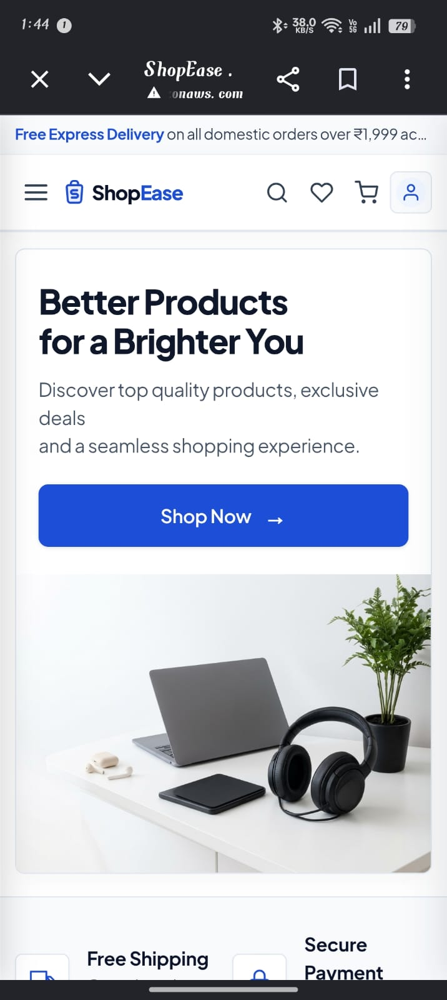

## 🧪 Testing

- Product browsing, search and category filtering
- Product details and reviews
- Cart and wishlist
- Signup and login
- Checkout
- Sandbox payment
- Order creation and idempotency
- My Orders and Order Details
- Invoice generation
- Order tracking
- Order cancellation
- Returns and replacement
- Warranty
- Customer support
- Responsive desktop and mobile layouts
- API Gateway and Lambda integration
- DynamoDB operations
- CloudWatch logging

## 🚀 Deployment Workflow

1. Develop and test the frontend in VS Code.
2. Develop the Python backend.
3. Configure IAM permissions.
4. Create DynamoDB tables.
5. Deploy the Lambda function.
6. Configure API Gateway routes.
7. Configure S3 static website hosting.
8. Upload frontend files to S3.
9. Verify CloudWatch logs and metrics.
10. Test the complete ShopEase application.
11. Commit changes with Git.
12. Push the project to GitHub.

## 🔒 Environment Variables

```text
AWS_REGION
TABLE_ORDERS
TABLE_USERS
TABLE_CART
TABLE_WISHLIST
TABLE_REVIEWS
TABLE_TICKETS
SHOPEASE_RESET_EMAIL_FROM
SHOPEASE_RESET_FRONTEND_URL
SHOPEASE_ADMIN_USER_IDS
SHOPEASE_ADMIN_EMAILS
```

## ⚠️ Limitations

- Payment is a sandbox/test implementation.
- No real money is charged.
- SES password-reset email requires configuration.
- Guest persistence uses browser storage.
- AWS functionality depends on correct AWS configuration.
- The S3 website endpoint uses HTTP static website hosting.

## 🔮 Future Scope

- CloudFront and HTTPS
- Custom domain
- Advanced CloudWatch dashboards and alarms
- Production payment gateway
- Advanced authentication
- Product recommendations
- Inventory management
- Expanded analytics
- CI/CD deployment
- Additional serverless AWS workflows

## 📚 References

- AWS S3 static website hosting docs:

https://docs.aws.amazon.com/AmazonS3/latest/userguide/WebsiteHosting.html

- AWS S3 samples GitHub:

 https://github.com/aws-samples/amazon-s3-static-website

- CloudFront setup guide:

https://docs.aws.amazon.com/Amazon CloudFront/latest/DeveloperGuide/GettingStarted.html

- AWS free tier overview: 

https://aws.amazon.com/free/

## 👨‍💻 Project Information

| Item | Details |
|---|---|
| Project | ShopEase |
| Project Title | Real-Time Serverless E-Commerce Application |
| Project Type | AWS Major Project |
| Backend | Python / boto3 |
| Frontend | HTML5, CSS3, Browser JavaScript |
| Hosting | Amazon S3 |
| API | Amazon API Gateway |
| Compute | AWS Lambda |
| Database | Amazon DynamoDB |
| Email | Amazon SES |
| Monitoring | Amazon CloudWatch |
| Security | AWS IAM |
| Development | Visual Studio Code |
| Source Control | Git / GitHub |
